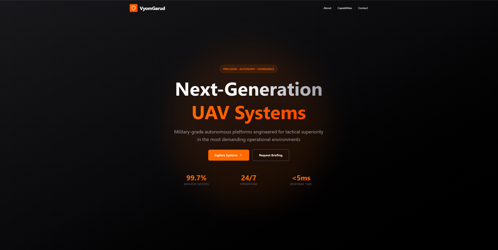
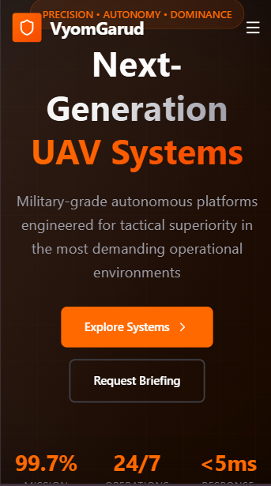

# VyomGarud - Military-Grade UAV Systems | Official Landing Page

A sleek, responsive landing page for **VyomGarud**, a next-generation unmanned aerial vehicle (UAV) systems company focused on precision engineering, autonomy, and defense-ready innovation.

Built using **Next.js**, styled with **Tailwind CSS**, and enhanced with subtle animations via **Framer Motion**.

---

### 🔧 Tech Stack

- **Framework**: react
- **Styling**: Tailwind CSS
- **Deployment**: Vercel-ready

---

### 🎨 Design Philosophy

Inspired by:

- [onomondo.com](https://onomondo.com): Clean sections, data-driven highlights, clear CTAs
- [raphe.com](https://www.raphe.com): Aerospace futurism, dark theme, R&D emphasis

**Brand Identity**:  
Military-grade reliability, autonomous intelligence, cutting-edge engineering.

**Color Palette**:

- Background: `#121212` (Charcoal Black)
- Text: `#FFFFFF`, `#E5E5E5`
- Accent: `#FF7B00` (Vibrant Orange)
- UI Elements: `#2a2a2a`

**Typography**:

- Headings: `Poppins`, bold and uppercase where appropriate
- Body: `Inter`, clean and readable

**Animations**:

- Fade-in on scroll (via Framer Motion)
- Hover effects on cards and buttons

### 🖼️ Screenshots

#### Desktop View



#### Mobile View



---


### 🚀 Setup Instructions

1. Clone the repo:
   ```bash
   git clone https://github.com/maniesh6900/vyomgarud-landing-page.git
   cd vyomgarud-landing-page
   ```
